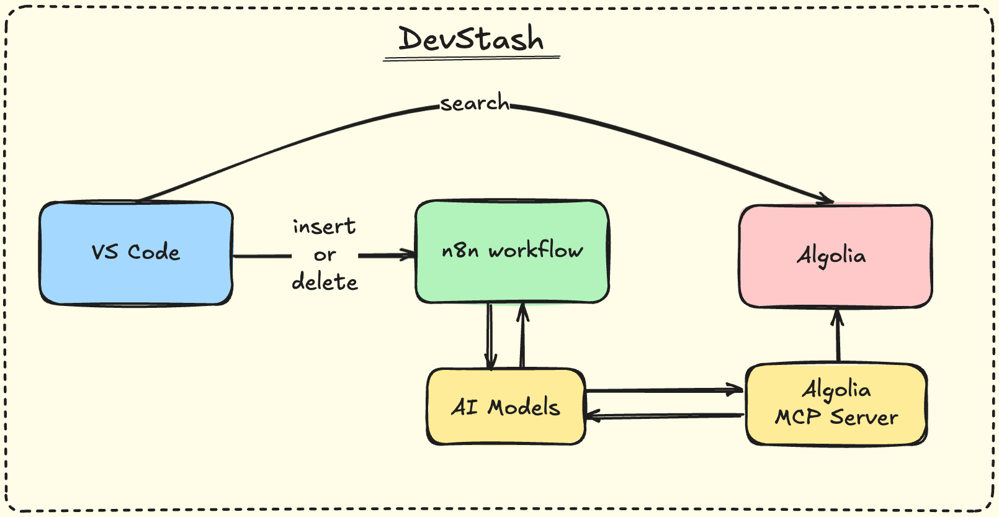

# DevStash

A comprehensive developer knowledge management system that allows you to save, organize, and search code snippets, commands, queries, notes, etc.

## System Architecture

The DevStash ecosystem consists of:
- **[VS Code Extension](https://github.com/bugcacher/devstash-vscode-extension)**: Frontend interface for saving, deleting, and searching snippets
- **n8n Workflow**: AI-powered backend processing and data orchestration
- **Algolia**: Combined storage and search engine
- **Algolia MCP Server**:  Model Context Protocol server for seamless AI assistant integration with your Algolia indexes
- **AI Models**: Intelligent content analysis and metadata extraction via OpenRouter

## Prerequisites

Before setting up DevStash, ensure you have:
- n8n instance (self-hosted or cloud)
- Algolia account
- OpenRouter API account (for AI processing)
- VS Code

## Installation Guide

### Step 1: Set up Algolia

1. Create an [Algolia account](https://www.algolia.com/)
2. Create a new application
3. Create an index (e.g., `stashes`)
4. Get your credentials:
   - Application ID
   - Search-Only API Key
   - Admin API Key (for n8n workflow)

### Step 2: Set up OpenRouter or any other LLM model account Gemini/Claude/Chat GPT (AI Processing)

1. Create an [OpenRouter account](https://openrouter.ai/)
2. Get your API key from the dashboard
3. Ensure you have credits for AI model usage
4. Note: The workflow uses models like `google/gemini-2.0-flash-001` for intelligent content processing

### Step 3: Deploy n8n Workflow

Follow the detailed [instructions](./n8n/README.md) for complete workflow installation and deployment

### Step 4: Install VS Code Extension

Follow the detailed [instructions](https://github.com/bugcacher/devstash-vscode-extension/blob/master/README.md) for complete vs code extension installation and configuration.

## Usage

### Saving Snippets
1. Select code in VS Code
2. Search for `Devstash: Save` command in command palette or press `Ctrl+Alt+S` (Windows/Linux) or `Cmd+Opt+S` (Mac)
3. Snippet is automatically saved and indexed

### Searching Snippets
1. Search for `Devstash: Search` command in command palette or press `Ctrl+Alt+D` (Windows/Linux) or `Cmd+Opt+D` (Mac)
2. Type your search query
3. Click on snippet to copy to clipboard

## Future Roadmap

- [DevStash CLI](https://github.com/bugcacher/devstash-cli/tree/master) (WIP)

## Links

- [VS Code Extension](https://github.com/bugcacher/devstash-vscode-extension)
- [n8n Workflow Deployment Instructions](./n8n/README.md)
- [n8n Render Deployment Instructions](./render/n8n-deploy.md)
- [Algolia MCP Server Render Deployment Instructions](./render/algolia-mcp-deploy.md)

## Contributing

Contributions are welcome! Please feel free to submit issues and pull requests.
